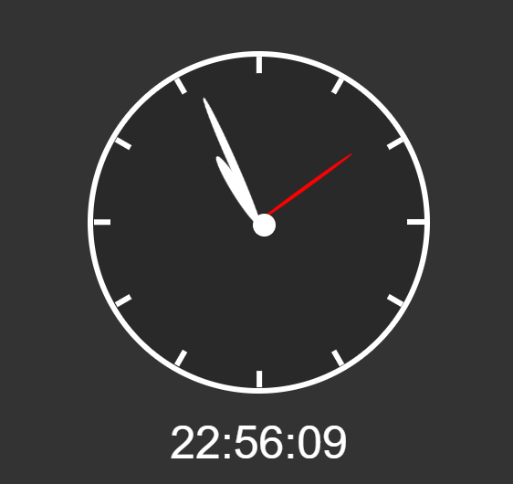

<h1 align="center">Relógio</h1>

## ✨ Tecnologias

Esse projeto foi desenvolvido com as seguintes tecnologias:

- [HTML](https://www.w3schools.com/html/)
- [CSS](https://www.w3schools.com/css/)
- [JavaScript](https://www.w3schools.com/js/)

## 💻 Projeto

Esse projeto tem como propósito montar dois relógios, um sendo digital e outro analógico. É um bom projeto para praticas o CSS, principalmente com o relógio analógico, e também entender melhor como trabalhar com funções de data e hora.

## 🚀 O projeto

---
Deixo aqui os créditos a B7Web por ensinar a como criar esse projeto.
